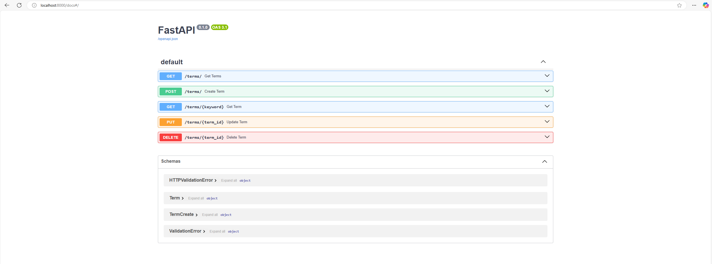
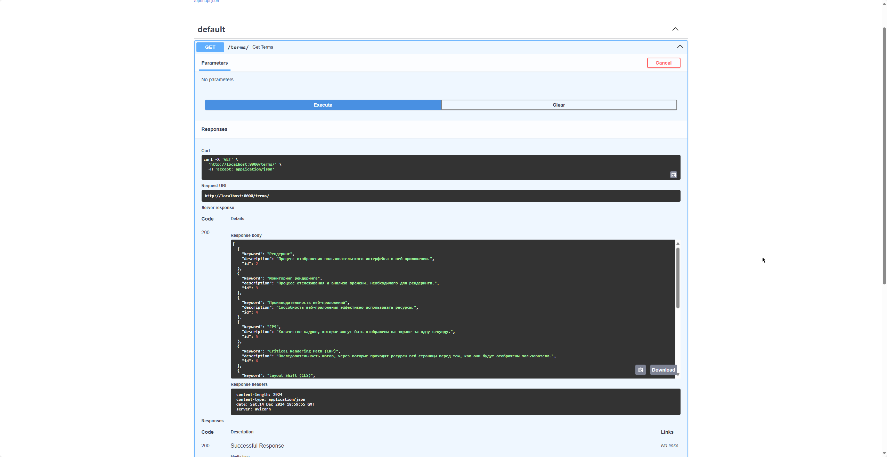

# Проект глоссария

Этот проект представляет собой веб-приложение для создания и управления глоссарием терминов с использованием FastAPI, SQLite и SQLAlchemy. Приложение предоставляет REST API для работы с терминами глоссария.

## Особенности

- Возможность создавать, читать, обновлять и удалять термины глоссария.
- Документация API с использованием Swagger.

## Установка и развертывание

### 1. Клонирование репозитория:

```bash
git clone https://github.com/rancerenly/rest-fastapi.git
cd glossary-project
```

### 2.1 Запуск с Docker

```bash
docker build -t glossary-project .

docker run -d -p 8000:8000 --name glossary-project-container glossary-project
```

### 2. Зависимости:

```bash
python -m venv venv
source venv/bin/activate  # Для Linux/macOS
venv\Scripts\activate     # Для Windows

pip install -r requirements.txt
```

### 3. Запуск приложения:
```bash
uvicorn app.main:app --reload
```

### 4.  Использование API:
Получение всех терминов:

```GET /terms/```

Получение информации о конкретном термине:

```GET /terms/{keyword}```

Добавление нового термина:

```POST /terms/```

Пример тела запроса:

```json
{
  "keyword": "Рендеринг",
  "description": "Процесс отображения пользовательского интерфейса в веб-приложении."
}
```

Обновление существующего термина:

```PUT /terms/{term_id}```

Пример тела запроса:

```json
{
  "keyword": "Рендеринг",
  "description": "Обновленное описание термина."
}
```

Удаление термина:

```DELETE /terms/{term_id}```

### 5. Swagger

Документация доступна по адресу: http://127.0.0.1:8000/docs


